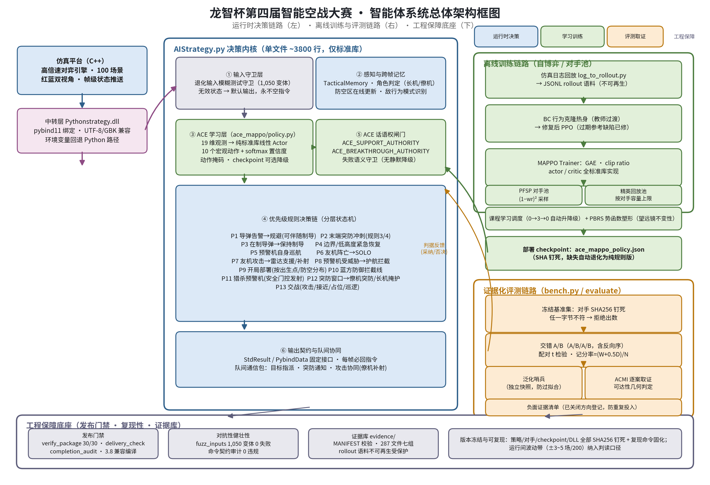

# 龙智杯第四届智能空战大赛 · 多智能体强化学习策略项目

> 为一个 2v2 智能空战任务设计、训练并验证一套 **CTDE（集中训练 / 分散执行）+ 战术选项层** 的多智能体强化学习策略，
> 并在一个**不可复现**的仿真平台上建立可统计的评测方法。

| | |
|:---|:---|
| **任务** | 2 机编队空战，部分可观测、合作型、对手为固定或历史策略 |
| **方法** | MAPPO（共享 actor + 集中式 critic）+ ACE 演化/精英层 + 规则状态机兜底 |
| **架构** | CTDE · 参数共享 · 10 个战术选项 · 合法性掩码 · 纯标准库推理 |
| **验证** | 标准化 100 场批次 · 双方向镜像 · 严格同帧命中判定 · 逐场景配对统计 |
| **状态** | 对固定基线稳定 79–81% 胜率；开关级改动全部经过 A/B |

> ⚠️ 本仓库**只包含我方自己的工作记录**。**不包含**主办方发布的任何软件、平台、手册或示例策略，
> 也**不包含**任何第三方代码。详见 [`NOTICE.md`](NOTICE.md)。

---

## 目录

- [0. 一分钟速览](#0-一分钟速览)
- [1. 背景与平台约束](#1-背景与平台约束)
- [2. 系统总览](#2-系统总览)
- [3. 多智能体强化学习设计](#3-多智能体强化学习设计)
  - [3.1 问题建模：为什么是 Dec-POMDP](#31-问题建模为什么是-dec-pomdp)
  - [3.2 为什么选 CTDE + 参数共享](#32-为什么选-ctde--参数共享)
  - [3.3 观测空间（19 维）](#33-观测空间19-维)
  - [3.4 动作空间：10 个战术选项](#34-动作空间10-个战术选项)
  - [3.5 合法性掩码：把安全约束前移](#35-合法性掩码把安全约束前移)
  - [3.6 先验初始化：不靠随机起步](#36-先验初始化不靠随机起步)
  - [3.7 集中式 critic 与团队奖励](#37-集中式-critic-与团队奖励)
  - [3.8 优化：PPO + ACE 演化/精英层](#38-优化ppo--ace-演化精英层)
  - [3.9 Checkpoint 契约](#39-checkpoint-契约)
  - [3.10 部署边界与失效降级](#310-部署边界与失效降级)
  - [3.11 一次决策的完整生命周期](#311-一次决策的完整生命周期)
- [4. 开发时间线](#4-开发时间线)
- [5. 训练过程](#5-训练过程)
- [6. 评测方法论](#6-评测方法论)
- [7. 关键结论](#7-关键结论)
- [8. 复现指南](#8-复现指南)
- [9. 已知限制](#9-已知限制)
- [10. 仓库结构](#10-仓库结构)

---

## 0. 一分钟速览

**做了什么**

1. 把"2 机编队空战"建模成合作型 Dec-POMDP，用 **MAPPO**（共享 actor + 集中式 critic）在**战术选项层**学习战术倾向。
2. 在 PPO 外面套了一层 **ACE 演化/精英机制**：变异采样、精英池、向精英软更新、精英轨迹行为克隆、对手课程。
3. 学习层**不掌握安全否决权**：导弹告警下的规避、火控校验、边界恢复由确定性规则层执行，并受合法性掩码约束。
4. 因为平台自带的解释器没有 NumPy/Torch，推理侧做成**纯标准库 + JSON 线性模型**，可直接逐字节校验。
5. 建立了一套可统计的评测方法（固定场景集、双方向镜像、严格同帧命中、逐场景配对检验）。

**最有价值的三个结论**（都是被数据推翻直觉后得到的）

| 结论 | 证据 |
|:---|:---|
| **平台单次运行不可复现** —— 单批 100 场的比分差异 ≤7pp 全是噪声 | 同构建同场景连跑两次，逐场胜负与 ACMI 哈希全不同 |
| **"补射灌水"是发射效率的主因** —— 同机对同目标第 3/4 发命中率仅 2.9%/0.8%，却占发射增量的 86% | 3021 发逐弹分析 + ACMI×调试日志联合取锁定目标 |
| **预警机失分是残局后果，不是护航问题** —— 被打时本方只剩 1 架战斗机、中位距离 148 km，且 87/87 全败 | 1200 场 ACMI 取证 |

---

## 1. 背景与平台约束

**任务**：为一支 2 机编队编写策略，在给定作战场景中与对手对抗。

**交付形态**：平台按槽位加载策略——`ACAS_01`~`ACAS_04` 各含一份策略文件与支撑模块；
一份 `SimuConfig.txt` 配置 N 个场景，平台一次运行跑完，写出逐场结果与 ACMI 轨迹。

平台有三个约束直接决定了架构，读后续章节时请记住它们：

| 约束 | 对设计的影响 |
|:---|:---|
| **无 Gym 接口**：只有"跑一次、读结果文件" | 训练环必须自己实现 rollout 与奖励解析，不能依赖现成 RL 环境 |
| **嵌入式解释器，无 NumPy/Torch** | 推理侧必须纯标准库；模型只能是**线性 + JSON**这种轻量形态 |
| **单次运行不可复现**（无随机种子控制） | 评测必须靠**重复批次 + 配对统计**，不能单批比比分 |

---

## 2. 系统总览




```
┌───────────────────────────────────────────────────────────────────┐
│                          仿真平台（黑盒）                           │
│  每帧下发 GlobalAIData：本机状态 / 雷达 / 导弹告警 / 火控 / 友机数据   │
│  每场结束写出 Result/SimuResultReport.txt 与 AcmiRecord/*.acmi      │
└───────────────┬───────────────────────────────────────────────────┘
                │ 每帧数据
                ▼
┌───────────────────────────────────────────────────────────────────┐
│                        策略入口（每架飞机）                          │
│                                                                   │
│   ┌───────────────────────────┐      ┌──────────────────────────┐  │
│   │   ACE 偏好层（学习得到）    │      │   规则状态机（确定性）      │  │
│   │  19 维局部观测              │      │   · 导弹告警 / 规避         │  │
│   │      ↓ 线性 actor           │──┐   │   · 制导维持 / 火控校验      │  │
│   │  10 个战术选项 + 合法性掩码  │  │   │   · 边界恢复 / 返航         │  │
│   └───────────────────────────┘  │   │   · 输出构造（指向本机）      │  │
│                                  ▼   │                          │  │
│                        战术倾向 ──────▶│  执行 + 安全否决           │  │
│                                  └───▶│                          │  │
│                                       └──────────────────────────┘  │
│                                                   │                │
│                                                   ▼                │
│                                          平台指令（飞控/传感/武器）    │
└───────────────────────────────────────────────────────────────────┘
```

**关键分工**：学习层回答"**往哪个战术方向走**"；规则层回答"**这一步具体怎么飞、能不能开火**"。
安全相关的否决权永远在规则层——这是本设计的核心取舍，详见 §3.5 与 §3.10。

---

## 3. 多智能体强化学习设计

### 3.1 问题建模：为什么是 Dec-POMDP

同队 2 架战斗机 = 2 个智能体，对手是外部策略（不可控、非平稳）。每个智能体：

- 只能看到**自己的** 19 维局部观测（部分可观测）；
- 动作影响**共享的**团队结果（合作型，非竞争型）；
- 需要与队友形成角色分工（长机 / 僚机、掩护 / 突防），但**不依赖显式通信协议**。

因此形式化为 **Dec-POMDP**：`⟨N=2, S, {A_i}, P, R, {Ω_i}, O, γ⟩`，
其中奖励 `R` 是**团队标量**（取自平台比分），而非个体奖励。

### 3.2 为什么选 CTDE + 参数共享

| 设计选择 | 备选方案 | 为什么不用备选 |
|:---|:---|:---|
| **CTDE**：训练用集中式 critic，执行只用局部 actor | 完全独立学习（IL） | IL 在部分可观测 + 合作任务下无法解决信用分配，队友行为会被当成环境噪声 |
| **参数共享**：两架飞机共用同一套 actor 权重 | 每架一个独立网络 | ① 样本量翻倍，② 角色分工**已经由观测与规则层编码**（长机/僚机、友机状态在 19 维里），不需要靠两套权重去学 |
| **集中式 critic**：38 维 = 2 × 19（两机观测拼接） | 只有局部 critic | 局部 critic 无法评估"我这一步对队友的影响"，训练信号更噪 |
| **同队只 2 个智能体**，对手不建模为智能体 | 把对手也当学习者（自对抗） | 对手不可控；用**对手课程 + 精英池**近似处理非平稳性即可（§3.8） |

> 参数共享 + 集中式 critic 正是 MAPPO 的核心配方：**执行期分散、训练期集中**。

### 3.3 观测空间（19 维）

每架飞机的局部观测（`build_observation`），全部裁剪到 `[-1, 1]`：

| # | 特征 | 归一化 / 编码 |
|---:|:---|:---|
| 0 | 本机高度 | `alt/7500 − 1` |
| 1 | 本机速度 | `spd/450 − 0.5` |
| 2, 3 | 本机航向 | `sin(h)`、`cos(h)` |
| 4 | 雷达目标数 | `n/4` |
| 5 | 首要目标距离 | `1 − r/120km`（越近越大） |
| 6, 7 | 目标方位角 | `sin`、`cos` |
| 8 | 目标相对高度 | `Δalt/10000` |
| 9 | 火控开火标志 | 0/1 |
| 10 | 导弹告警数量 | `n/3` |
| 11, 12 | 威胁方位角 | `sin`、`cos` |
| 13 | 在制导导弹数 | `n/3` |
| 14 | 友机存活 | 0/1 |
| 15 | 友机正在攻击 | 0/1 |
| 16 | 阵营符号 | 红 +1 / 蓝 −1 |
| 17, 18 | 本机经纬度 | `lon/180`、`lat/90` |

**三个刻意的设计点**

1. **角度用 sin/cos 而不是弧度值**：避免 ±π 附近的跳变破坏线性模型的连续性。
2. **相对量优先**（相对距离、相对高度），而非绝对坐标——绝对经纬度只占 2 维，用于区分战场位置。
3. **队友信息显式入观**（14/15 维）：参数共享下，这是智能体知道"我该当长机还是僚机"的主要依据。

**v2 → v3 的演进（已训练、已测量、未上线）**：v3 把观测扩到 28 维
（战场归一化位置替代原始弧度比、增加目标速度/方位/俯仰、本机俯仰/过载/挂载、逐帧差分）。
它在最难快照的 40 场筛查里回退到 **33 → 27**，因此保持 opt-in（`ACE_OBS_LAYOUT=v3`），不随包发布。
**结论：更丰富的观测不等于更好的策略，必须过筛查门槛。**

### 3.4 动作空间：10 个战术选项

动作不是舵面/油门，而是**战术选项**（options）：

| 动作 | 语义 | 由规则层如何执行 |
|:---|:---|:---|
| `patrol` | 巡逻 | 沿任务航路巡航 |
| `approach` | 接近 | 爬升接近目标 |
| `attack` | 攻击 | 进入攻击航路并尝试发射 |
| `evade` | 规避 | 导弹告警下的脱靶机动 |
| `guide` | 制导 | 维持对已发导弹的制导 |
| `support` | 支援 | 掩护长机 / 补位 |
| `escort` | 护航 | 保持在预警机附近 |
| `breakthrough` | 突防 | 向防御点纵深突击 |
| `defense_line` | 防御线 | 前出拦截线待战 |
| `search` | 搜索 | 扩大搜索 |

**为什么在选项层做 RL，而不是控制层？**

- **信用分配**：一次空战 ~4000 帧（0.1 s/帧），控制层动作空间巨大且稀疏；
  选项层把时间尺度压缩到"战术阶段"级别，PPO 才能在几十~几百场内学到东西。
- **安全**：控制层策略一旦学坏会直接撞地/失速；选项层由确定性规则执行，**天然安全**。
- **可解释**：每个动作有名字，日志里能直接读出"这一帧它在想什么"，便于排查。
- 这是标准的 **options / 半马尔可夫** 思路：学习"选哪个选项"，执行交给下层。

### 3.5 合法性掩码：把安全约束前移

仅靠奖励惩罚"非法动作"太慢，因此在**采样之前**用掩码把非法选项的概率置零
（`action_mask`，作用于 softmax 的输入）：

```
导弹告警存在（mslCnt > 0 或 threatInfos 非空）
    → 只允许 { evade, guide }，其余 8 个选项概率为 0
```

这保证了三件事：**非法选项永远不会被采样到**；策略梯度只在合法子空间里更新；
即使 checkpoint 损坏导致 fallback，也不会产生非法输出。

### 3.6 先验初始化：不靠随机起步

`SharedActor` 的初始权重是**手工设定的先验**，而不是随机数——这直接决定了 PPO 的起点质量：

| 动作 | 先验（特征索引 → 权重） | 含义 |
|:---|:---|:---|
| `patrol` | bias = +0.50 | 默认保守：无信息时巡逻 |
| `approach` | f4 +1.5，f5 +0.8 | 目标多、距离近 → 接近 |
| `attack` | f4 +1.0，f9 +2.5 | 有目标且能开火 → 攻击 |
| `evade` | f10 +4.0 | 告警越多 → 越该规避 |
| `guide` | f13 +4.0 | 在制导 → 维持制导 |
| `support` / `escort` / `breakthrough` | f15 / f17 / f18 = +3.5 | 队友攻击 / 位置 / 阵营 |
| `defense_line` | f18 −3.5 | 红方倾向防御线 |
| `search` | f17 −3.5 | 远离本方侧 → 搜索 |

**为什么重要**：稀疏奖励下随机初始化的策略几乎不会产生有效样本；先验让"未训练的 checkpoint 也是合理策略"，
PPO 从有意义的行为分布开始探索，ACE 的变异/精英机制也有可用的起点。

### 3.7 集中式 critic 与团队奖励

- **critic 输入 = 38 维** = 两架同队飞机的 19 维观测**拼接**（`GLOBAL_OBS_DIM = OBS_DIM × 2`）。
- **奖励是团队标量**，取自平台结果文件（红/蓝比分），同队两个智能体共享同一个值。
- **优势估计**：GAE，`γ = 0.99`、`λ = 0.95`，逐智能体计算后做**优势归一化**。
- 训练时每个智能体贡献一条 transition（`observation / global_state / action / old_logp / value / reward / advantage / return`）。

这带来一个直接结论：**critic 只在训练期存在**。执行期不需要队友信息，也不需要通信——
这正是 CTDE 想要的形态。

### 3.8 优化：PPO + ACE 演化/精英层

**基础优化器**：PPO，截断代理目标。

| 超参 | 值 |
|:---|:---|
| `clip_ratio` | 0.2 |
| 训练轮数 `epochs` | 4 |
| actor 学习率 | 0.035 |
| critic 学习率 | 0.025 |
| rollout 长度 | 96 步 |
| 优势 | GAE（γ=0.99，λ=0.95）+ 归一化 |

**ACE 层**——在 PPO 外面套的一层演化/精英机制，用来对抗"稀疏奖励 + 单轨迹"的低效：

| 机制 | 实现 | 作用 |
|:---|:---|:---|
| **变异采样** | `mutate_actor`：对全部 actor 参数加高斯噪声 σ=0.04 | 在权重空间做局部搜索，生成候选"变异体" |
| **精英池** | `ElitePool(capacity=4)`：按得分保留最优的几份策略快照 | 防止策略退化，保存历史最优 |
| **软更新** | `soft_update(α=0.12)`：把当前策略往精英方向拉 | 平滑地把精英的"好习惯"注入当前策略 |
| **精英轨迹回放** | `EliteTrajectoryPool` + `apply_elite_replay(lr=0.012)` | 对成功轨迹做一次小幅**行为克隆**，直接复用"赢的那几局" |
| **对手课程** | `OpponentCurriculum`：得分 ≥0.55 升一级、<0.25 降一级（0–3 级） | 对手难度随能力自适应，避免过难导致零信号 |

一句话概括：**PPO 提供稳定的策略梯度；ACE 提供"变异—选拔—回放"的探索与记忆。**

### 3.9 Checkpoint 契约

模型 = **线性 actor（10×19 权重 + 10 偏置）+ 线性 critic（38 权重 + 偏置）**，序列化为 JSON：

```json
{
  "format": "ace-mappo-linear-v1",
  "version": 1,
  "obs_dim": 19,
  "global_obs_dim": 38,
  "action_dim": 10,
  "actor_weights": [[...19...], ...10...],
  "actor_bias": [...10...],
  "critic_weights": [...38...],
  "critic_bias": 0.0
}
```

**加载时逐项严格校验**：`format` / `version` / `obs_dim` / `action_dim` / 权重维度全部匹配才接受，
否则**拒绝加载并退化到规则层**。因为是纯 JSON，checkpoint 可以**逐字节 diff、哈希校验、版本对比**——
这也是后来能做"单开关 A/B 的字节级证明"的基础。

### 3.10 部署边界与失效降级

| 边界 | 处理 |
|:---|:---|
| 解释器没有 NumPy / Torch | 推理纯标准库；模型只用 `math` + 列表推导 |
| checkpoint 缺失 / 损坏 / 维度不符 | `load_state_dict` 返回 False → 规则层接管，不抛异常 |
| 推理期异常 | `try/except` 捕获 → 标记 `ace_failed` → 本帧退回规则决策 |
| 学习层越权 | 两个显式闸门 `ACE_SUPPORT_AUTHORITY` / `ACE_BREAKTHROUGH_AUTHORITY` 控制学习层能否抢占分支 |
| 输出合法性 | 所有指令显式指向**本机**（早期版本会因工厂默认值把指令发给 1 号机，已修复） |

> 顺带一提：那两个闸门后来用 **3 × 200 场交错 A/B** 验证过——**没有可测影响**
> （95% CI `[−3.7%, +4.2%]`）。也就是说在当前骨架下，学习层的"越权"与否不影响胜负，
> 安全约束由规则层单独承担即可。

### 3.11 一次决策的完整生命周期

```
 1. 平台下发本帧 GlobalAIData
 2. 构造 19 维局部观测（角度转 sin/cos、量纲归一化、裁剪到 [-1,1]）
 3. 计算合法性掩码（导弹告警 → 只开放 evade / guide）
 4. 线性 actor 出 logits → 掩码 softmax → 取 argmax（执行期确定性）
 5. 得到战术倾向（如 attack）+ 置信度
 6. 规则状态机接手：检查火控（shootFlag / Rmax / Rtr / 离轴角 / 能量）
      ├─ 不满足 → 执行接近/占位等安全行为
      └─ 满足   → 发射 + 进入制导，或执行对应的战术机动
 7. 组装平台指令（飞控 / 传感 / 武器），全部显式指向本机
 8. 异常或越界 → 退回规则层输出，保证本帧永远有合法指令
```

---

## 4. 开发时间线

| 日期 | 阶段 | 主要工作 | 关键结论 / 产出 |
|---|---|---|---|
| 08-12 | 准备 | 平台资料解压、环境搭建 | 包结构梳理 |
| 08-28 ~ 08-29 | 首轮评测 | 20 场批量评测 | 策略 DLL 初始化成功、stderr 为空，确认平台可跑 |
| 09-04 | 环境归因 | 提交包与接口排查 | 三类问题：①提交包隐含假设（Python 路径硬编码、`Result/`/`AcmiRecord/` 缺失、Torch 与嵌入式解释器不一致）②接口/策略（`flightRole` 为 FREE 的兜底、并发制导上限）③评测设计（红方先手导致自对抗失真）。产出《问题归因与优化报告》与《环境自检.py》 |
| 09-05 | 首个 100 场批次 | 标准 20 场景 ×5，四槽同策略 | 发现 **NWU 航向转换缺陷**：防御航点航向用 `atan2(Δ纬度, Δ经度)`，而平台约定 0°=正北、90°=正东，导致蓝方被错误转成南向指令并出界 |
| 09-06 | 接入学习层 | MAPPO + ACE 部署到四槽 | 分层架构定型（规则层 + 学习层） |
| 09-08 ~ 09-09 | 大规模自对抗 | 批量对局、自对抗分支实验 | 批量评测流水线 |
| 09-10 | 目标化训练 | train90 数据集、目标 90% 门槛 | 训练集与验收门槛固定 |
| 09-11 | 沙箱化评测 | 独立沙箱 200 场；人工 100 场 | 对固定基线胜率进入 95–100% 区间 |
| 09-12 | **方法论转折** | 修复 `guide_msl_cnt` 顺序缺陷；7 批重复 A/B；双方向 200 场 | **发现平台不可复现**；确定"单批比分差异 ≤7pp 是噪声" |
| 09-14 | 效率专题 | 逐弹级发射/命中分析 | **定位"补射灌水"**（第 3/4 发命中率 2.9%/0.8%，占增量 86%） |
| 09-15 | 几何调整 | 蓝方拦截线插值锚点 + 侧向偏置 | 无可测影响 |
| 09-16 | 单开关 A/B | 补射上限（每机每目标 2 发） | 发射 −16%、命中 **+12%**、命中率 +8.7pp；机制验证第 3/4 发精确归零。**未采纳** |
| 09-17 | 收口验证 | 双闸门 3×200 交错 A/B；预警机取证 | 闸门无可测影响；预警机失分确认为残局后果 |

---

## 5. 训练过程

### 5.1 两段式训练环

刻意**不**把仿真器包装成 Gym 环境，而是切成两半：

- **mock 环**（`train_mvp.py`）：验证算法契约——rollout、GAE、PPO 截断更新、ACE 变异/精英/回放。
  零第三方依赖，可秒级跑完，用来防止"算法实现错了却以为是策略不行"。
  mock 奖励是稠密的（动作正确 +1、错误 −0.25，难度 ≥2 时额外惩罚不必要巡逻）。
- **真实边界**（`sim_platform.py`）：只负责与平台的真实接口——调用平台、解析
  `Result/SimuResultReport.txt` 的前两行比分，作为**团队标量奖励**回传。

**为什么这样切**：真平台一次跑 100 场要 ~8 分钟且不可复现，不能拿它当单元测试。
mock 环保证算法正确性，真平台只负责提供噪声很大的真实信号。

### 5.2 自对抗与课程

- **精英池**保存历史最优快照，对局在"当前策略 vs 历史快照/固定基线"之间轮换，避免自对抗退化。
- **对手课程**（0–3 级）按当前得分自适应升降，避免对手过强导致零学习信号。
- **精英轨迹回放**把"赢的那几局"的决策直接用行为克隆巩固下来。

### 5.3 迭代纪律

- 观测编码升级（v2→v3）必须过**最难受场景筛查**才允许上线；v3 未通过 → 回退并保持 opt-in。
- 任何改动都要能**字节级 diff**（见 §3.9），且必须配可重复的 A/B（见 §6）。

---

## 6. 评测方法论

平台不可复现，所以评测做成了可统计的流程，而不是"跑一批看比分"：

| # | 做法 | 为什么 |
|---:|:---|:---|
| 1 | **固定场景集**：标准 20 场景 × 5 = 100 场，编号 1–100 | 跨批次可比 |
| 2 | **双方向镜像部署**：同一策略分别装红方与蓝方，各 100 场 | 抵消先手 / 出生位置的结构性优势 |
| 3 | **严格同帧命中判定**：导弹与**异色**飞机在**同一 0.1 s 帧块**内被删除才算命中 | 早期"±1.5 s 且 ≤5 km"的宽松规则会多造约 14 对假命中 |
| 4 | **ACMI × 调试日志联合**：ACMI 没有锁定目标字段，从平台调试日志按（射手, 发射时刻）对齐取出锁定目标与火控包线 | "同目标第 N 发"分析的前提，覆盖率 99%+ |
| 5 | **量化噪声底线**：同构建重复多批 | 命中率批间 SD 仅 0.47pp、发射量 CV 2.4%，而比分批间 SD 达 8–9 场 → **比分不做单批比较** |
| 6 | **单开关 A/B**：变体文件字节级 diff 证明只差目标常数 → 双方向 × 多轮**交错**执行 → 逐场景配对检验（配对 t + Wilcoxon + 场景聚类 bootstrap 95% CI） | 把"改动有效"从感觉变成区间 |
| 7 | **轮换顺序**：3 轮交错采用 A→B / B→A / A→B | 让批次顺序不偏向任一变体 |

---

## 7. 关键结论

### 7.1 系统性发现

- **平台不可复现**（09-12）：同构建、同场景连跑两次，逐场胜负与 ACMI 哈希全不同，5 场里 2 场翻转。
  → 任何单批比分结论都必须带噪声条。
- **补射灌水**（09-14，最大单项发现）：同一架飞机重复打同一目标——第 1 发命中率 43.5%、
  第 2 发 28.4%、第 3 发 2.9%、第 4 发 0.8%；**60.8% 的发射属于这种自我重复**。
  根因：饱和计数器只统计**在飞**导弹，一发打空、计数归零后同一目标立刻"解禁"。
- **红/蓝严重不对称**：同一策略打红方 ~61%、打蓝方 ~99%。决定胜负的是"站哪一侧"，
  远大于任何单个开关的效应。
- **预警机失分是残局后果**（09-17，1200 场）：我方预警机被打 87 次、对手 8 次，**87/87 全败**；
  被击落时刻中位数 421 s（整局约 430–460 s），当时本方只剩 1 架战斗机、中位距离 148 km。
  且预警机槽位没有 Python 策略，**不受我方代码控制**。

### 7.2 开关级 A/B 一览

| 改动 | 结论 | 证据强度 |
|:---|:---|:---|
| `guide_msl_cnt` 顺序缺陷修复 | 异常 6146 → 0；对胜率无可测影响 | 强（异常计数确定） |
| 蓝方防御线几何（09-15） | 无可测影响 | 中（单批 + 对照组同幅波动） |
| 补射上限 = 2 | 发射 −16%、命中 **+12%**、命中率 +8.7pp、比分 +12 胜 | 强（效率）/ 中（比分）；**未采纳** |
| 双闸门 `ACE_SUPPORT/BREAKTHROUGH_AUTHORITY` | 无可测影响，95% CI `[−3.7%, +4.2%]` | **强**（每变体 600 场，逐场景配对） |

> 关于"补射上限"：效果明确且机制被验证（第 3/4 发精确归零），但项目最终**未采纳**。
> 本仓库如实记录实验与数据，供后续判断。

### 7.3 方法层面的收获

1. **先证明"没有效应"，再谈"有效应"** —— 平台不可复现这件事，比任何单项策略改动都更值得先搞清楚。
2. **效率指标比比分更适合做单批判定**（命中率批间 SD 0.47pp vs 比分 8–9 场）。
3. **机制验证要落到个体**（逐弹、逐帧），否则"发射变多"这种聚合指标无法区分原因。
4. **约束前移优于奖励惩罚**：把安全约束做成掩码/规则层，比让 RL 从惩罚里学会"别撞地"可靠得多。

---

## 8. 复现指南

```text
scripts/
  analyze_manual100.py      # ACMI 层指标：发射/命中/越界/突防（严格同帧规则）
  report_manual100.py       # 单批 markdown 报告
  compare_runs.py           # 两批对照（含逐场翻转表）
  report_vs_baseline.py     # 双方向 plus-vs-基线对照报告
  ab_stats.py               # 多批重复 A/B 的逐场景配对统计
  gates_stats.py            # 同上，用于双闸门 3x200 批次
  noise_analysis.py         # 噪声底线量化
  waste_analysis*.py        # 逐弹发射效率（严格命中口径）
  waste_join_analysis.py    # ACMI x 调试日志：同目标第 N 发
  waste_crosstab.py         # 剥离"距离 vs 第几发"的混杂
  ewa_analysis*.py          # 预警机失分取证
  throttle_design.py        # 先量后定：单机上限 vs 编队上限的取舍分析
  make_gate_variants.py     # 生成单开关变体 + 字节级 diff 证明
  add_throttle.py           # 补射上限补丁（单开关）
  run_*.ps1                 # 批次驱动（部署 → 跑 → 归档 → 分析）
```

**典型流程**

1. 把变体策略放进各槽位的 `Pythonstrategy/`（`AIStrategy0X.py` + 支撑模块 + checkpoint）。
2. 用 `run_*.ps1` 逐批驱动：清空 `Result/`、`AcmiRecord/` → 跑平台 → 归档 → 调分析脚本。
3. 用 `ab_stats.py` / `gates_stats.py` 做逐场景配对检验，看 **95% CI 是否含 0**。

数据文件：`data/waste_by_scenario.csv`（20 个基础场景的发射/命中/命中率）。

---

## 9. 已知限制

- 平台**无随机种子控制**，只能靠重复批次与配对统计压制噪声。
- 调试日志的包线字段是**每 25 帧（≈2.5 s）**采样，不是发射瞬间，火控判定为近似。
- 上述结论基于**标准 20 场景集**与**单一对手基线**；换场景或换对手未必成立。
- 观测编码 v3 已训练但**未上线**；本仓库描述的行为以 v2 为准。
- 模型是**线性**的（这是嵌入式解释器的约束），并非深度网络；表达能力有上限。

---

## 10. 仓库结构

```
README.md                  本文件
NOTICE.md                  版权与合规声明（必读）
docs/                      结论报告
  AB_repeat_report.md          平台不可复现性 + 重复批次 A/B 方法论
  vs_baseline_trend_*.md       三次重复对照趋势
  reattack_cap_ab_*.md         补射上限单开关 A/B
  gates_ab_3x200_*.md          双闸门 3x200 交错 A/B
  ewa_forensics_*.md           预警机失分取证
  waste_report_*.md            发射效率专题
scripts/                   分析脚本与批次驱动
data/                      小体积结果表
```
